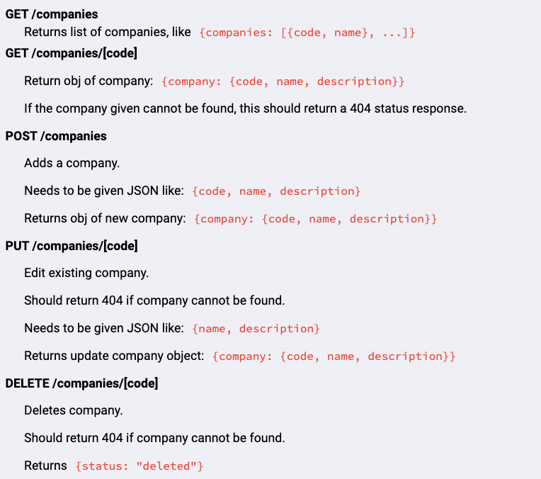

# A Node.js, Express, and PostgreSQL application to query and update the two endpoints below, accompanied by screenshots of functional requirements.

# http://localhost:3000/companies

# http://localhost:3000/invoices
