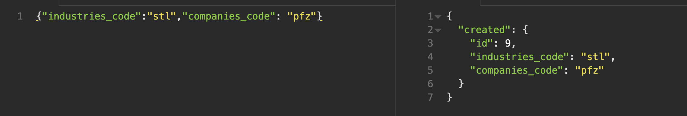

# A Node.js, Express, and PostgreSQL application to query and update the two endpoints below, accompanied by screenshots of functional requirements.

# http://localhost:3000/companies

# http://localhost:3000/invoices

# http://localhost:3000/industries

- GET /industries
  -Returns list associating industries to company codes.
  

- POST /industries
- Adds an industry.
  

- POST /industries/associate-company
- Adds a new association between an industry and company code.
  
